**[Portfolio](https://mariamoussa.github.io)** &nbsp;·&nbsp; **[LinkedIn](https://www.linkedin.com/in/moussamaria/)** &nbsp;·&nbsp; **[Email](mailto:mariamoussamoussa96@gmail.com)** &nbsp;·&nbsp; Beirut, Lebanon &nbsp;·&nbsp; remote-first, US and EU hours

 

## About

I build the systems companies run on: payment rails, internal platforms, stock management, patient records. Six years across fintech, healthcare and e-commerce, most of it on the parts users never see, plus the interfaces they use every day.

Right now I lead development of a healthcare provider's internal platform at **TotalCare** (US) and run backend for the **Flyesim** eSIM platform. I also translate stakeholder requirements into technical specifications, run technical interviews, and mentor engineers through code review and onboarding.

 

## Selected work

| Project | What it is |
|:--|:--|
| **[Stock Now](https://stocknow.co.za/)** | Stock management and ordering across three apps (Client, Driver, Warehouse Picker) serving a large user base in South Africa. [Client](https://play.google.com/store/apps/details?id=com.navybits.stocknow) · [Driver](https://play.google.com/store/apps/details?id=com.navybits.stocknow.driver) |
| **[OMT Wallet and ATM](https://www.omt.com.lb/en)** | Wallet backend for P2P, P2C and C2P transfers at Western Union's Lebanese agent network. I built the **ATM services end to end as the sole developer**. |
| **[Flyesim](https://flyesim.net/)** | Travel eSIM platform. Scalable REST APIs on a microservice architecture, mobile and web, with CI/CD I own end to end. |
| **[Order of Engineers, Tripoli](https://oea-tripoli.org.lb/en)** | The syndicate's website, rebuilt on Next.js for performance and search visibility. |
| **[Ruby Rose](https://www.rubyroselb.com/)** | POS frontend, maintained and optimised with responsive behaviour as the priority. |

 

## Stack

 

## AI in the toolkit

AI is part of how I plan, build and review, and increasingly part of what I ship: model APIs wired into real applications with proper error paths, prompt design, structured outputs and cost control.

**38 certifications completed in 2026**, five of them direct from **Anthropic** (*Claude with Amazon Bedrock*, *Claude with Google Vertex AI*, and the AI Fluency series), plus the Microsoft and LinkedIn Generative AI career path, and the Docker Foundations, Atlassian Agile PM and Aha! Product Management certificate paths.

 

## Contribution graph

<picture>
  <source media="(prefers-color-scheme: dark)" srcset="https://raw.githubusercontent.com/mariamoussa/mariamoussa/output/snake-dark.svg" />
  <source media="(prefers-color-scheme: light)" srcset="https://raw.githubusercontent.com/mariamoussa/mariamoussa/output/snake.svg" />
  
</picture>

 

Most of my production work lives in private company repositories. The links above are the live systems.

